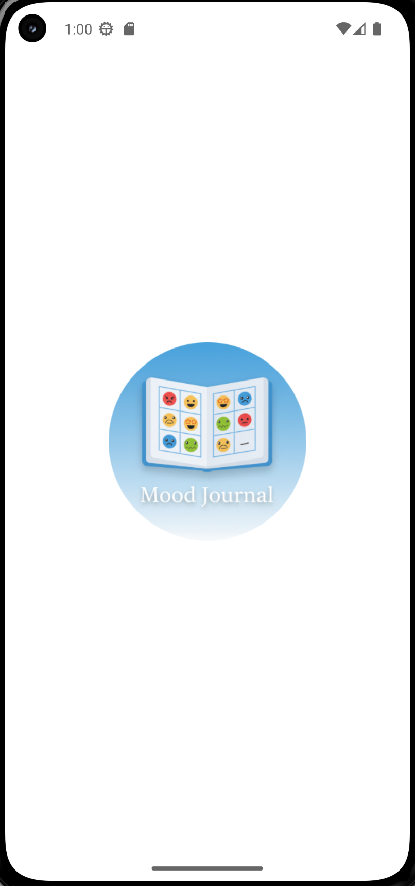
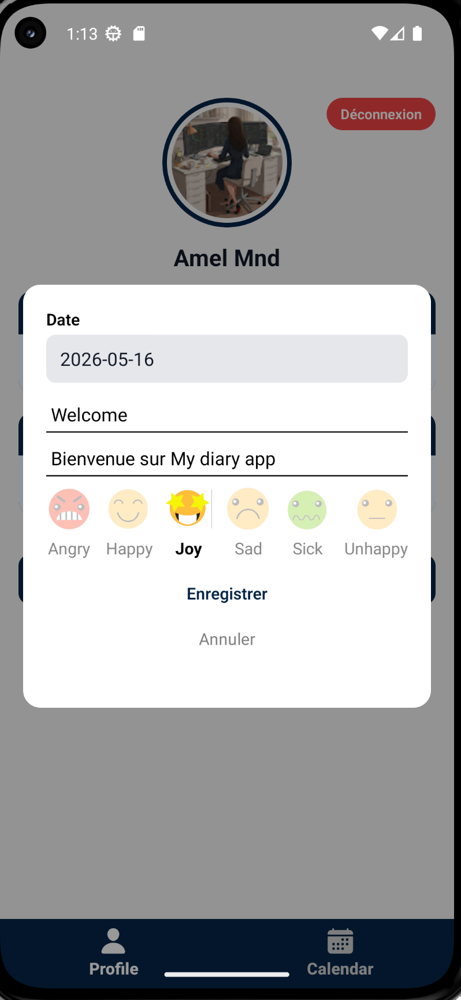
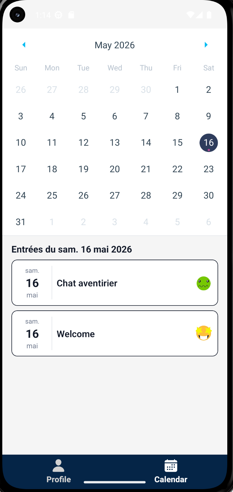
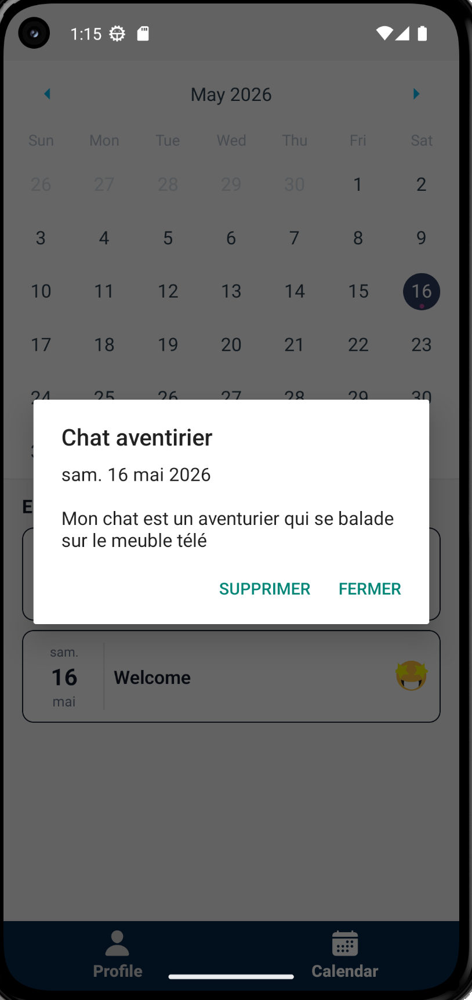

# Diary App

Diary App est une application mobile développée dans le cadre des modules 04 et 05 de la Piscine Mobile 42.
Elle permet de créer et gérer des entrées personnelles sécurisées avec authentification, base de données temps réel et agenda interactif.

---

## Description

L’application repose sur deux grands axes issus des exercices des modules :

### Module 04 — Auth & Database

- Authentification utilisateur avec Google et GitHub
- Gestion des sessions utilisateur
- Création, lecture et suppression d’entrées
- Stockage des données avec Firebase Firestore
- Mise à jour dynamique des données

### Module 05 — Manage Data & Display

- Page Profile avec statistiques utilisateur
- Affichage des dernières entrées
- Répartition des émotions utilisées
- Agenda interactif avec calendrier
- Consultation des entrées par date
- Mise à jour temps réel des données

---

## Stack technique

- **Langage** : TypeScript
- **Framework mobile** : React Native
- **Environnement** : Expo
- **Authentification** :
  - Firebase Auth
  - Google Auth
  - GitHub Auth

- **Base de données** :
  - Firebase Firestore

- **Navigation** :
  - Expo Router / React Navigation

- **Styling** : React Native StyleSheet

---

## Structure du projet

```bash
diaryapp/
├── app/
│   ├── components/                  # Composants réutilisables
│   │   ├── EntryCard.tsx
│   │   ├── LoginButton.tsx
│   │   ├── EmotionStats.tsx
│   │   ├── CalendarView.tsx
│   │   └── ModalEntry.tsx
│   │
│   ├── screens/                     # Écrans principaux
│   │   ├── LoginScreen.tsx
│   │   ├── ProfileScreen.tsx
│   │   └── AgendaScreen.tsx
│   │
│   ├── services/                    # Firebase / Auth / DB
│   │   ├── firebase.ts
│   │   ├── auth.ts
│   │   └── firestore.ts
│   │
│   ├── hooks/
│   │   └── useDiaryEntries.ts
│   │
│   └── types/
│       └── diary.ts
│
├── assets/
├── readmeImg/
└── README.md
```

---

## Installation

### 1. Cloner le projet

```bash
git clone git@github.com:USERNAME/diary-app.git
cd diary-app
```

### 2. Installer les dépendances

```bash
npm install
```

### 3. Configurer Firebase

Créer un fichier `.env`

```env
EXPO_PUBLIC_FIREBASE_API_KEY=YOUR_API_KEY
EXPO_PUBLIC_FIREBASE_AUTH_DOMAIN=YOUR_AUTH_DOMAIN
EXPO_PUBLIC_FIREBASE_PROJECT_ID=YOUR_PROJECT_ID
EXPO_PUBLIC_FIREBASE_STORAGE_BUCKET=YOUR_STORAGE_BUCKET
EXPO_PUBLIC_FIREBASE_MESSAGING_SENDER_ID=YOUR_SENDER_ID
EXPO_PUBLIC_FIREBASE_APP_ID=YOUR_APP_ID
```

### 4. Lancer l'application

```bash
npm start
```

---

## Aperçu du rendu

<div align="center">

  
  
  
  
  

</div>

---

## Licence

Projet réalisé dans le cadre de la Piscine Mobile 42.
